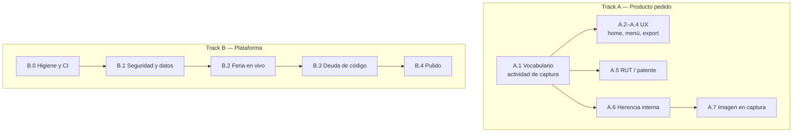

# Plan de mejora — Transworld Nexus (RegisPro)

Versión de referencia: `1.6.0+22` (`main` @ `a75a479`).
Audiencia: el equipo que opera y desarrolla RegisPro.

Dos frentes, en paralelo:

1. **Track A — Producto pedido.** Los siete cambios de vocabulario, UX y
   validación que el equipo pidió. Se pueden empezar ya: no dependen de
   CI ni de RLS.
2. **Track B — Plataforma.** Seguridad, feria en vivo, deuda de código y
   pulido. Es el trabajo que evita que un evento grande o un organizador
   con PostgREST tumben la operación.

Cada ítem apunta a un archivo o comportamiento concreto. Lo que no está
acá se considera fuera de alcance hasta que el producto lo pida.

---

## 1. Glosario (a partir de este plan)

Hoy la UI dice “evento” para dos cosas distintas. Eso es el origen de
casi todo el Track A.

| En pantalla (nuevo) | Qué es | Tabla / tipo actual |
|---|---|---|
| **Evento** | Registro y acreditación de asistentes. | `public.eventos` / `Evento` |
| **Actividad de captura** o **actividad de leads** | Campaña donde se capturan leads. Nace de un evento (interna) o se crea suelta (externa). | `public.eventos_leads` / `EventoLead` |
| **Actividad interna** | Ligada 1:1 a un evento (`tipo_evento_lead = 'interno'`, `evento_origen_id` NOT NULL). Nombre, fecha, país, temática e imagen **se heredan** del evento. | `EventoLead.esInterno` |
| **Actividad externa** | Creada a mano, sin evento de origen. Sus campos se editan en la propia actividad. | `tipo = externo` |

En código y SQL el nombre físico puede seguir siendo `eventos_leads`
mientras conviva el proyecto hermano “capturador-leads” (ver §B.1.5).
En **toda la UI** se deja de decir “evento de leads”.

---

## 2. Diagnóstico

RegisPro ya no es el prototipo legado. El núcleo de negocio está unificado
en Flutter (Android, iOS, Web, Windows) sobre Supabase, con roles
(`admin` / `organizador` / `user` / `externo`), cola offline única,
RLS con helpers `rpe_*`, OTA por GitHub Releases y un rediseño visual
avanzado.

El cuello de botella ahora no es “hacer que funcione”, sino **operar un
evento en vivo** y **que evento ≠ actividad de captura se entienda solo**.

### Lo que ya está bien (no rehacer)

- Motor offline unificado (`SyncQueueService` + `SyncCoordinator` +
  conflictos terminales).
- Escalación de rol bloqueada en trigger (`rpe_prevent_role_self_escalation`).
- Deduplicación de registrados con `UNIQUE (evento_id, email)`.
- Autoregistro público dentro de la app (`/r/:eventoId`).
- Alcance de lectura de eventos/registrados vía `rpe_puede_operar_evento`.
- Vínculo 1:1 actividad interna ↔ evento por `evento_origen_id` (no por
  nombre): `evento_lead_interno_service.dart`.
- OTA Android/Windows con verificación SHA-256 y rollback en Windows.
- Suite de tests de modelos, cola, router y widgets (~60 archivos).

### Hallazgos que sí pesan

| Área | Hallazgo | Evidencia |
|---|---|---|
| Producto | “Evento” y “evento de leads” conviven en labels, home, menús y rutas. | `HomeFeaturedItem.ctaLabel` = “Ver evento de leads”; tiles en `usar_evento_screen.dart`. |
| Producto | La actividad interna se edita como si fuera independiente. | `CrearEditarEventoLeadScreen` no mira `esInterno`; `toUpdateMap()` persiste nombre/fecha/país/temática. |
| Producto | El hero de captura no muestra la foto del evento. | `EventoLead` no tiene `imagenUrl`; `UsarEventoLeadScreen._hero` no pasa `photo`. |
| Producto | Exportación: copy en una card, botones sueltos debajo. Importación sí mete el CTA dentro. | `exportar_screen.dart`, `exportar_leads_screen.dart`. |
| Producto | RUT y patente solo exigen “no vacío”. | `campos_registro_asistente.dart` → `validarCampoRequerido`. |
| Seguridad | Un organizador puede **actualizar cualquier evento**. | `rpe_eventos_update` usa `rpe_can_create_content()` sin alcance. |
| Operación | Listados y KPI cargan **toda** la tabla del evento en el cliente. | `listarPorEvento` sin paginación; `kpiDataPorEventoProvider`. |
| Operación | Offline y caché viven en `SharedPreferences`. | `sync_queue_service.dart`, `offline_read_cache.dart`. |
| Calidad | Dos sistemas de diseño y tres librerías de widgets. | `AppColors` + `TwColors`; `app_widgets` / `nexus_components` / `tw_components`. |
| DX | No hay CI; faltan `.env.example` y `docs/NOTIFICACIONES_PUSH.md`. | No existe `.github/workflows/`. |

---

## 3. Cómo priorizar

| Prioridad | Criterio | Ejemplo |
|---|---|---|
| **P0** | Riesgo de datos, seguridad, evento en vivo, o bloqueante del vocabulario. | RLS de UPDATE; cola que se pierde; copy “evento de leads” en producción. |
| **P1** | UX pedida o calidad que multiplica el costo de cada feature. | CTAs del home, herencia de campos, CI, diseño dual. |
| **P2** | Pulido. Se hace cuando P0/P1 del mismo módulo no están abiertos. | Dark mode, KPI de leads, accesibilidad fina. |

Esfuerzo relativo: **S** (< 1 cambio acotado), **M** (un módulo),
**L** (cruza app + backend + operación).

Reglas de corte:

- Track A no espera a Track B, salvo que toquen el **mismo archivo** en
  el mismo PR (entonces se parte).
- El rename de copy (A.1) va **antes** de A.2–A.7 para no reescribir
  strings dos veces.
- No mezclar rediseño visual (B.3.1) con RLS (B.1.1).

---

## 4. Hoja de ruta



A y B arrancan juntos. Dentro de cada track, el orden de IDs es el de
los PRs.

---

# Track A — Producto pedido

Los siete puntos del equipo, en el orden en que se implementan.
A.1 es la base; el resto puede ir en PRs separados.

## A.1 Vocabulario: `eventos_leads` → actividad de captura — P0 / M

**Pedido:** dejar de hablar de “evento de leads”. Se conoce como
**actividad de captura** o **actividad de leads**.

Hoy el usuario ve dos “eventos” (registro vs captura) en home, listas,
menús, toasts y rutas. Ejemplos literales:

| Sitio | Copy actual |
|---|---|
| Home, card fijada | Eyebrow `EVENTO DE LEADS FIJADO`; CTA `Ver evento de leads` (`home_featured_item.dart`) |
| Menú del evento | `Ver evento de leads` / `Crear evento de leads` (`usar_evento_screen.dart`) |
| Hub de captura | Eyebrow `Detalle del evento`; snackbars `Evento actualizado` (`usar_evento_lead_screen.dart`, `crear_editar_evento_lead_screen.dart`) |
| Listado capturador | Títulos/menús de “evento” (`listar_eventos_leads_screen.dart`) |
| Bottom nav / rutas | Comentarios y labels mezclados (`tw_bottom_nav_bar.dart`, `route_paths.dart`) |

### Cómo hacerlo (tres olas, no un mega-diff)

| Ola | Alcance | Qué no hacer |
|---|---|---|
| **1. Copy de UI** (este ítem) | Strings visibles: labels, títulos, toasts, `Semantics`, Excel headers de leads si dicen “evento”. Glosario en este doc. | No renombrar clases Dart ni tablas. |
| **2. Identificadores Dart** | Cuando un archivo de A.2–A.7 se toque, ir migrando `EventoLead` → `ActividadCaptura` en ese módulo. Tests del mismo PR. | No un rename masivo de 80 archivos el mismo día que A.2. |
| **3. SQL** | **No ahora.** La tabla `eventos_leads` y las políticas `cl_*` se quedan: el schema avisa que la base puede estar compartida con “capturador-leads”. Si más adelante se renombra, será `actividades_captura` + vista de compatibilidad `eventos_leads`. | No `ALTER TABLE RENAME` en el mismo PR que el copy. |

Diccionario de copy (ola 1):

| Antes | Después |
|---|---|
| Evento de leads | Actividad de captura |
| Crear evento de leads | Crear actividad de captura |
| Ver evento de leads | Ver actividad de captura |
| Evento de leads fijado | Actividad fijada |
| Nuevo evento (pantalla capturador) | Nueva actividad |
| Editar evento (hub captura) | Editar actividad |
| Eliminar el evento de captura | Eliminar la actividad de captura |

Criterio de hecho: `rg -n "evento de leads" lib test` no devuelve strings
de UI (los comentarios de código que hablen de la tabla SQL sí pueden
quedar). Tests de `HomeFeaturedItem` y de las pantallas de menú actualizan
las aserciones de texto.

---

## A.2 CTA “Capturar lead” en la actividad fijada del home — P1 / S

**Pedido:** agregar el botón **Capturar lead** a la actividad fijada en
el home.

Hoy (`proximo_evento_card.dart` + `HomeFeaturedItem`):

- Evento (próximo o fijado): CTA primario `Ver evento` + secundario
  `Escanear QR`.
- Actividad fijada (`campanaFijada`): un solo CTA `Ver evento de leads`.
  `puedeEscanearQr` es `false`, así que no hay segundo botón.
- `HomeFeaturedItem.campanaFijada` no copia imagen (A.7).

### Qué hacer

En la card de `kind == campanaFijada`:

1. CTA primario: **Capturar lead** → `RoutePaths.capturarLead(id)`.
2. CTA secundario (ghost): **Ver actividad** →
   `RoutePaths.usarEventoLead(id)` (el hub).

No poner “Capturar lead” en un evento de registro: ahí el segundo botón
sigue siendo escanear QR.

Archivos: `home_featured_item.dart`, `proximo_evento_card.dart`,
`test/features/home/home_featured_item_test.dart`,
`test/features/home/proximo_evento_card_test.dart`.

Criterio de hecho: con una actividad fijada, el home muestra “Capturar
lead” y navega al formulario de alta; “Ver actividad” abre el hub.
Un evento fijado no gana ese botón.

---

## A.3 Mover “Crear/ver actividad” a acciones del evento — P1 / S

**Pedido:** pasar el botón “crear / ver evento de leads” a la sección de
**acciones normales** del evento y llamarlo **Crear actividad de captura**.

Hoy en `usar_evento_screen.dart` el tile vive bajo **Administración**,
junto a KPI y Excel:

```
Acciones del evento
  Registrar asistente
  Lista de asistentes registrados
Administración
  Gestionar acceso          ← admin
  Ver / Crear evento de leads
  KPI del evento
  Importar o Exportar
```

Destino:

```
Acciones del evento
  Registrar asistente
  Lista de asistentes registrados
  Crear actividad de captura   ← si aún no existe (canCreateContent)
  Ver actividad de captura     ← si ya existe el vínculo interno
Administración
  Gestionar acceso
  KPI del evento
  Importar o Exportar
```

Copy:

- No existe aún: **Crear actividad de captura** (el pedido literal).
  Subtítulo: “Capturar oportunidades en este evento”.
- Ya existe: **Ver actividad de captura**. Mismo `onTap` de hoy
  (`usarEventoLead`). No duplicar “Crear” si el 1:1 interno ya está.

La lógica `_crearEventoLead` / `obtenerOCrearEventoLeadInterno` no cambia.
Tests: `test/features/usar_app/usar_evento_screen_test.dart`.

Criterio de hecho: el tile no aparece bajo “Administración”; el texto
visible es el del glosario; crear sigue siendo 1:1 por `evento_origen_id`.

---

## A.4 Botones de exportación dentro de la card — P1 / S

**Pedido:** integrar los botones de exportación **dentro** de la card de
información, igual que la de importación.

Hoy en `exportar_screen.dart` (registrados):

- Card “Exportación”: solo el párrafo explicativo.
- Fuera: `PrimaryGradientButton` “Exportar todos…” y `NexusActionRow`
  “Exportar solo acreditados”.
- Card “Carga masiva”: texto **y** el botón “Elegir archivo .xlsx”
  **adentro**. Ese es el patrón a copiar.

`exportar_leads_screen.dart` tiene el mismo problema (card hueca + botón
suelto). Ahí no hay importación; igual el CTA entra a la card.

### Qué hacer

Una card de exportación con:

1. `SectionLabel('Exportación')` + copy.
2. Botón primario dentro: exportar todos.
3. En registrados, el secundario “solo acreditados” también dentro
   (mismo `NexusActionRow` o un outline debajo, no fuera del borde).

Misma geometría (padding 16, `AppRadius.lg`, sombra rest) que la card
de carga masiva. No inventar un tercer layout.

Criterio de hecho: en ambas pantallas no queda ningún botón de exportar
entre las dos cards ni debajo de la primera. Tests de widget, si los hay,
siguen encontrando los mismos labels.

---

## A.5 Validar RUT y patente del registrado — P1 / M

**Pedido:** validar RUT y patente en los datos del registrado.

Hoy los campos existen (`registrados.rut`, `registrados.patente`) y se
muestran cuando el evento tiene `certificacionCapacitacion`. El único
validador es `validarCampoRequerido`. Al salir de patente se hace
`trim().toUpperCase()`, nada más. Excel importa el texto crudo.

Aplica a: alta (`registrar_confirmado_screen.dart`), edición
(`editar_registrado_screen.dart`), formulario público si esos campos
están activos, e importación Excel (`excel_import_registrados.dart`).

### RUT / RUC

- Chile (RUT): dígitos + DV, módulo 11, aceptar con o sin puntos/guion.
  Normalizar a `12.345.678-9` al persistir (el test de modelo ya usa
  ese formato).
- Si el evento no es Chile o el label sigue diciendo “RUT / RUC”:
  RUC/tax id extranjero = no vacío + longitud razonable (no inventar
  el algoritmo de cada país). Documentar en el validador qué se exige
  por `evento.pais`.
- Vacío: sigue siendo inválido **solo** si `mostrarCertificacion` está
  on. Si el campo no se muestra, no validar.

### Patente

- Chile vigente: AA-BB-12 (6 caracteres alfanuméricos) o antigua
  `ABCD12` / `AB1234`. Persistir en mayúsculas, sin espacios.
- Rechazar símbolos y longitudes imposibles.
- Vacío: misma regla que RUT (requerido solo con certificación).

Implementación en `lib/core/utils/registro_asistente.dart` (junto al
teléfono), no en cada pantalla. Tests en
`test/core/utils/registro_asistente_test.dart`: casos buenos, DV mal,
patente corta, import Excel que descarta o marca fila inválida.

Criterio de hecho: un RUT con DV incorrecto no entra ni por formulario
ni por Excel; una patente `12` tampoco. El Happy path
`12.345.678-9` + `ABCD12` del test de modelo sigue pasando.

---

## A.6 Bloquear datos heredados de la actividad interna — P1 / M

**Pedido:** no se pueden modificar a mano los datos de una actividad de
captura que hereda de un evento interno. Esos campos cambian con el
evento al que está ligada.

Hoy `obtenerOCrearEventoLeadInterno` **copia** nombre, fecha, país,
temática y flag de certificación **solo al crear**. Después:

- `CrearEditarEventoLeadScreen` deja editar esos campos siempre.
- `EventoLead.toUpdateMap()` los manda a Supabase.
- Si alguien renombra el evento, la actividad interna se queda con el
  nombre viejo.

### Contrato

Campos gobernados por el evento origen (actividad interna):

`nombre`, `fecha`, `pais`, `temática`, `certificacion_capacitacion`,
e imagen (A.7).

Campos propios de la actividad (si aparecen más adelante): no aplica
todavía; no hay extra.

### App

- Si `evento.esInterno`: el formulario de edición es **solo lectura** en
  esos campos, con copy “Estos datos vienen del evento ligado”. El lápiz
  del hub puede ocultarse o abrir esa vista read-only (eliminar sigue
  siendo admin).
- `toUpdateMap()` para internas no incluye los campos gobernados (defensa
  en cliente). Actividad **externa**: formulario igual que hoy.

### Backend (fuente de verdad)

Trigger `AFTER UPDATE OF nombre, fecha, pais, tematica,
certificacion_capacitacion, imagen_url ON public.eventos` que replica a
`eventos_leads` donde `evento_origen_id = NEW.id AND tipo_evento_lead =
'interno'`.

Defensa extra: trigger `BEFORE UPDATE` en `eventos_leads` que rechaza
cambios a esos columnas si `tipo_evento_lead = 'interno'` (salvo que
`current_setting` / `session_user` sea el trigger de sync, o comparar
NEW con el row del evento origen). Así un `UPDATE` por API tampoco
desvía la copia.

Criterio de hecho:

1. Editar el nombre del evento actualiza la actividad interna sin pasar
   por la UI de captura.
2. El formulario de una interna no deja guardar un nombre distinto.
3. Una actividad externa sigue editándose.
4. Test SQL o de repositorio cubre el sync; test de widget cubre el
   read-only.

---

## A.7 Imagen del evento en la captura de leads — P1 / M

**Pedido:** mostrar la imagen del evento en el flujo de captura de leads.

Hoy `eventos.imagen_url` se ve en el menú del evento, el home (solo
ítems `Evento`) y el hub del externo. La actividad **no tiene** imagen:

- `EventoLead` no mapea `imagen_url`.
- `HomeFeaturedItem.campanaFijada` no setea `imagenUrl`.
- `UsarEventoLeadScreen._hero` no pasa `photo` a `TwHeroCard`.
- `CrearLeadScreen` usa `PersonaIdentityBanner` + foto del **lead**, no
  portada del evento.

### Qué hacer

1. **Interna:** no guardar una segunda foto. Resolver
   `eventoOrigen.imagenUrl` (join o provider del evento origen). Cuando
   el evento cambia la imagen, A.6 la refleja.
2. **Externa:** opcional en este PR — o bien sin foto, o un
   `SelectorImagen` propio. No bloquear A.7 de internas por las externas.
3. Superficies, en este orden:
   - Hero del hub (`UsarEventoLeadScreen`), mismo `TwHeroCard.photo` que
     el menú de evento.
   - Card del home cuando el ítem es actividad fijada (A.2).
   - Cabecera de `CrearLeadScreen`: banda o hero compacto con la foto
     detrás del título “Capturar · {nombre}”, sin comerse el avatar del
     lead.

`EventoHeroFoto` ya encapsula red + velo; reutilizarlo.

Criterio de hecho: una actividad interna cuyo evento tiene `imagen_url`
muestra esa foto en hub, home fijado y alta de lead. Quitar la foto del
evento la quita también en captura (vía A.6). Tests: extender
`home_featured_item_test` (hoy solo cubre imagen de `Evento`) y el test
del hub de captura.

---

## Orden de PRs — Track A

PRs chicos, un tema por PR. A.1 primero.

| # | PR | IDs |
|---|---|---|
| 1 | Copy UI: actividad de captura / leads | A.1 ola 1 |
| 2 | Menú del evento: tile en Acciones + nuevo nombre | A.3 |
| 3 | Home: Capturar lead en actividad fijada | A.2 |
| 4 | Cards de exportar con botones adentro | A.4 |
| 5 | Validadores RUT + patente | A.5 |
| 6 | Herencia interna (UI read-only + triggers) | A.6 |
| 7 | Imagen del evento en captura | A.7 (después de A.6) |

A.2 y A.3 pueden invertirse; no pueden mergearse antes de A.1 o el copy
queda a medias. A.7 después de A.6 para no pelearse con el sync de
`imagen_url`.

---

# Track B — Plataforma

El trabajo de fondo. Numeración `B.n` para no chocar con A.

## B.0 Higiene de repo y entrega continua

Dejar el repo en un estado en el que un clon fresco y un PR no dependan
de “lo corrí en mi máquina”.

| ID | Ítem | P | Esf. | Qué hacer | Criterio de hecho |
|---|---|---|---|---|---|
| B.0.1 | Restaurar `.env.example` | P0 | S | El `.gitignore` ya tiene `!.env.example`, pero el archivo no está versionado. Documentar `SUPABASE_*`, `GITHUB_*`, buckets y `APP_PUBLIC_BASE_URL` **sin secretos**. | Un clon + `cp .env.example .env` basta para saber qué falta. |
| B.0.2 | Restaurar `docs/NOTIFICACIONES_PUSH.md` | P1 | S | El README y `.cursorignore` lo citan; el archivo no estaba. Recrear el checklist FCM + webhook `enviar-push`. | El enlace del README resuelve. |
| B.0.3 | Dejar de empaquetar `.env` como asset | P0 | S | `pubspec.yaml` declara `- .env` en `flutter.assets`. En release eso puede meter secretos en el bundle. Cargar dotenv desde archivo no embebido / `--dart-define` / flavors. | `flutter build apk --release` no incluye URL ni anon key reales en assets. |
| B.0.4 | CI mínimo | P0 | M | Workflow GitHub Actions: `flutter pub get`, `dart format --set-exit-if-changed`, `flutter analyze`, `flutter test`. Stub de `firebase_options.dart` como ya describe el README. | Cada PR falla en rojo si analyze/test se rompen. |
| B.0.5 | Analyzer más estricto | P1 | S | Activar en `analysis_options.yaml`: `prefer_single_quotes`, `avoid_print`, `unawaited_futures`, `discarded_futures`. Ir archivo por archivo. | `flutter analyze` limpio con las reglas nuevas. |

**No hacer en esta fase:** migrar a Riverpod Generator, ni partir
pantallas, ni tocar RLS.

---

## B.1 Seguridad y modelo de datos

Cerrar huecos que un cliente autenticado (o `anon`) puede explotar
llamando a Supabase directo, sin pasar por la UI.

### B.1.1 RLS: UPDATE acotado al evento — P0 / S

Hoy:

```sql
-- eventos
USING (public.rpe_can_create_content())
-- eventos_leads  (actividad de captura)
USING (public.rpe_can_create_content())
```

Cualquier `organizador` puede alterar **cualquier** evento o actividad.
Alinear con SELECT:

```sql
USING (public.rpe_can_create_content() AND public.rpe_puede_operar_evento(id))
```

Para `eventos_leads`, definir el helper equivalente (actividad propia /
origen autorizado) y usarlo en UPDATE. Añadir tests SQL o un script de
regresión (admin sí, organizador sobre evento ajeno no, user no).

SELECT ya está acotado; falta WRITE. Coordinar con A.6: el trigger de
sync debe poder escribir la copia interna aunque el caller no edite
`eventos_leads` a mano.

### B.1.2 Superficie anónima del formulario público — P0 / M

`rpe_eventos_select_publico` expone **todos** los eventos activos al
rol `anon` (`USING (activo = true)`). El formulario solo necesita
**un** evento por UUID en la URL.

- Restringir SELECT anónimo a un RPC `rpe_evento_publico(p_id)` que
  devuelva nombre/fecha/activo, no el row completo.
- Rate-limit de INSERT anónimo (edge function o trigger + intentos por
  IP/email) para no llenar `registrados` con spam.
- Confirmar que `anon` no puede SELECT `registrados` (hoy correcto).

### B.1.3 Edge Functions — P1 / M

- CORS: dejar `*` solo si el formulario público en otro origen lo
  necesita; si no, allowlist `regispro.transworld.cl` y
  `eventos.transworld.cl`.
- Quitar el comentario “para llamar desde React”.
- `enviar-qr` usa service role y acepta un `record` en el body: validar
  JWT del caller y que el `registrado.id` pertenezca a un evento que
  el caller puede operar.
- Tests Deno (al menos CORS + auth negativa) en `supabase/functions/`.

### B.1.4 Secretos y Storage — P1 / S

- El footer de `enviar-qr` hardcodea un project ref
  (`PIE-DE-FIRMA.png`). Mover a env (`BREVO_FOOTER_IMAGE_URL`).
- Subir `Plantilla_Registro.xlsx` al bucket `plantillas` **o** generar
  la plantilla en cliente.

### B.1.5 Schema como migraciones — P1 / L

`schema.sql` (2569 líneas, idempotente) es la fuente única y
`supabase/migrations/` está vacío a propósito.

1. Dejar `schema.sql` como snapshot bootstrap (bases nuevas).
2. A partir de ahora, **todo cambio** (A.6 incluido) entra como archivo
   en `supabase/migrations/YYYYMMDDHHMM_descripcion.sql`.
3. El README deja de decir “aplicar el monolito otra vez” para
   ambientes que ya existen.
4. No renombrar la tabla `eventos_leads` ni las políticas `cl_*` /
   `rpe_*` mientras la base pueda estar compartida con capturador-leads.

---

## B.2 Operación en feria

Un evento con 2–5k registrados y Wi-Fi malo es el caso de uso real.
Hoy la app asume listas pequeñas y una sola fuente de verdad en memoria.

### B.2.1 No bajar el evento entero al teléfono — P0 / L

- Paginación o ventana deslizante en `listarPorEvento` / lista de leads.
- Búsqueda y filtros (acreditado / pendiente / texto) **en servidor**.
- KPI: RPC `rpe_kpi_evento(p_evento_id)` que devuelva
  `total, acreditados, top_empresas` sin traer filas.
  `KpiScreen` deja de depender de `registradosPorEventoProvider`.

### B.2.2 Realtime en acreditación — P0 / M

Hoy Realtime solo alimenta el inbox (`notificaciones_inbox`). En puerta
hay varios dispositivos acreditando el mismo evento.

- Canal por `evento_id` en `registrados` (UPDATE de `acreditado`).
- Invalidar el resumen, no re-descargar la lista completa.
- Backoff si el canal se cae; el modo offline ya existe.

### B.2.3 Persistencia offline durable — P0 / L

Reemplazar cola + `OfflineReadCache` por **SQLite** (`drift` o
`sqflite`):

- Tabla `sync_queue` (id, table, op, payload, retries, conflict).
- Tabla `cache_rows` (tabla, evento_id, row_json, updated_at).
- Fotos pendientes ya están en disco (`pending_photo_store_io.dart`);
  no meter bytes en prefs.
- Migración única desde `sync_queue_v2_*`.

### B.2.4 Observabilidad — P0 / M

- Firebase Crashlytics (Android/iOS) + no-fatals en `enviar-qr`, sync
  y OTA.
- Breadcrumbs: `evento_id`, rol, online/offline. **Nunca** email ni
  token.

### B.2.5 Conflictos de sync — P1 / M

La bandeja existe (`SyncConflictListener` + sheet). Falta pantalla
propia, resolución explícita (descartar local / servidor / fusionar
email) y tests de widget del flujo.

### B.2.6 KPI de actividades de captura — P2 / M

`KpiScreen` solo habla con `eventos` / `registrados`. El tile está
comentado en el hub de captura. Nueva pantalla: total, origen
interno/externo, capturas por perfil, fotos pendientes. Copy del
glosario (A.1), no “KPI del evento de leads”.

---

## B.3 Deuda de código

Hacer esto **después** de que feria y RLS no ardan. Si se mezcla con
B.2.1, el diff se vuelve intocable. El rename Dart de A.1 ola 2 **sí**
puede ir módulo a módulo aquí.

### B.3.1 Un solo sistema de diseño — P1 / L

1. `TwColors` / `TwSpacing` / `TwRadii` son la fuente de verdad.
2. `AppColors` queda como alias durante un ciclo de release.
3. Fusionar `nexus_components.dart` → `tw_components.dart`.
   `app_widgets.dart` se queda con `LoadingView` / `ErrorView` /
   `EmptyView`.
4. Prohibir hex sueltos en pantallas nuevas.

No rediseñar. Solo una paleta. A.4 debe usar los tokens ya existentes,
no una tercera card.

### B.3.2 Partir pantallas-dios — P1 / M cada una

Umbral: >400 líneas o >20 KB. Orden: `lista_leads_screen.dart`,
`ver_registrados_screen.dart`, `home_screen.dart`, `app_router.dart`,
formularios de usuario/evento. Cada extracción mueve sus tests.

### B.3.3 Capa de datos testeable — P1 / M

- `abstract interface` por repositorio.
- `mocktail` en `test/data/repositories/`.
- Fake de `SyncExecutor` para el coordinador.
- Prohibir `Supabase.instance` dentro de `features/`.

Riverpod Generator **no** es requisito.

### B.3.4 StateNotifier residual — P2 / S

Migrar cola y OTA a `Notifier` / `AsyncNotifier` cuando se toquen esos
archivos por otra razón.

---

## B.4 Pulido de plataforma

Solo con B.0–B.2 cerradas en lo P0. No pisa Track A.

| ID | Ítem | P | Esf. | Notas |
|---|---|---|---|---|
| B.4.1 | Push FCM en dashboards | P1 | M | Inbox in-app ya funciona. Falta webhook DB → `enviar-push`. |
| B.4.2 | Dark mode | P2 | M | Tokens ya ramifican por `Brightness.dark`; no hay `themeMode`. Esperar B.3.1. |
| B.4.3 | Accesibilidad | P2 | M | TalkBack/VoiceOver en escáner, público, acreditación, nav iOS. |
| B.4.4 | Íconos / splash definitivos | P2 | S | `flutter_launcher_icons` ya está; verificar binarios nativos. |
| B.4.5 | Release automatizado | P2 | L | Action en tag `vX.Y.Z` → APK + ZIP con nombres `*-regispro-v*`. |
| B.4.6 | Google Fonts en runtime | P2 | S | Bundlear la familia; el login no debe saltar de fuente sin red. |
| B.4.7 | Formulario público PWA | P2 | M | Cache de assets, meta OG por evento. |

---

## 5. Orden global de PRs

Dos colas. No un “mega plan implementado”.

**Cola producto (Track A):** A.1 → A.3 → A.2 → A.4 → A.5 → A.6 → A.7.

**Cola plataforma (Track B):** B.0.1–0.4 → B.1.1 → B.2.1 → B.2.2 →
B.2.4 → B.2.3 → B.3.1 → pantallas-dios → B.2.6 / B.4.1.

Si un PR de A y uno de B tocan el mismo archivo (`usar_evento_screen`,
hub de captura, schema), gana el que ya está en review; el otro rebasea.

Cada PR: tests que fallen antes del fix cuando sea posible, y marcar el
ID como hecho en este documento.

---

## 6. Métricas de salida

**Track A está cumplido cuando:**

- En la UI no queda “evento de leads”; se lee actividad de captura / de
  leads.
- El home de una actividad fijada ofrece **Capturar lead**.
- “Crear actividad de captura” vive en Acciones del evento, no en
  Administración.
- Exportar se dispara desde dentro de su card, igual que importar.
- Un RUT con DV malo o una patente imposible no entra al registrado.
- Los campos de una actividad interna cambian al editar el evento y no
  se pueden editar en la actividad.
- El hero de captura muestra la foto del evento ligado.

**Track B está cumplido cuando:**

- Un organizador **no** puede `UPDATE` un evento que no opera, ni por
  API.
- Un evento de 5.000 registrados abre KPI y listado en < 2 s en un
  Android de gama media.
- Acreditar en un teléfono se refleja en otro sin pull-to-refresh.
- La cola offline sobrevive a un kill de la app y a 50 ítems con foto.
- `main` no se mergea si `analyze` o `test` fallan.

---

## 7. Fuera de alcance (a propósito)

- Reescribir en otra tecnología. Flutter multiplataforma es la apuesta.
- Play Store / App Store como canal principal. OTA por GitHub Releases
  cubre el modelo actual.
- i18n. La app es español de Chile.
- Renombrar ahora la tabla SQL `eventos_leads` o las políticas `rpe_` /
  `cl_` (base posiblemente compartida). El rename es de **producto**,
  no de Postgres, hasta A.1 ola 3.
- Riverpod Generator, freezed masivo, o hexagonal architecture.

---

## Referencias rápidas

| Tema | Dónde |
|---|---|
| Correcciones vs legado | `README.md` § “Qué se corrigió” |
| Schema / RLS | `supabase/schema.sql` |
| Actividad de captura (hoy `EventoLead`) | `lib/data/models/evento_lead.dart` |
| Alta interna 1:1 | `lib/features/capturador/services/evento_lead_interno_service.dart` |
| Menú del evento | `lib/features/usar_app/screens/usar_evento_screen.dart` |
| Hub de captura | `lib/features/capturador/screens/usar_evento_lead_screen.dart` |
| Home fijados | `lib/features/home/models/home_featured_item.dart` |
| Export registrados / leads | `exportar_screen.dart`, `exportar_leads_screen.dart` |
| RUT / patente UI | `lib/core/widgets/campos_registro_asistente.dart` |
| Cola offline | `lib/data/offline/sync_queue_service.dart` |
| Roles | `lib/core/constants/app_role.dart` |
| Tokens | `lib/core/theme/tw_tokens.dart`, `app_theme.dart` |
