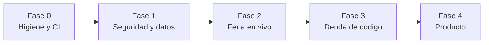

# Plan de mejora — Transworld Nexus (RegisPro)

Versión de referencia: `1.6.0+22` (`main` @ `a75a479`).
Audiencia: el equipo que opera y desarrolla RegisPro.
Objetivo: priorizar el trabajo que más reduce riesgo operativo en feria y
deuda técnica, sin reabrir lo que ya quedó resuelto en la reconstrucción
Flutter.

Este documento no es un backlog infinito. Cada ítem apunta a un archivo o
comportamiento concreto del repo. Lo que no está acá se considera
fuera de alcance hasta que el producto lo pida.

---

## 1. Diagnóstico

RegisPro ya no es el prototipo legado. El núcleo de negocio está unificado
en Flutter (Android, iOS, Web, Windows) sobre Supabase, con roles
(`admin` / `organizador` / `user` / `externo`), cola offline única,
RLS con helpers `rpe_*`, OTA por GitHub Releases y un rediseño visual
avanzado.

El cuello de botella ahora no es “hacer que funcione”, sino **operar un
evento en vivo con datos grandes, red intermitente y un código que creció
por capas**.

### Lo que ya está bien (no rehacer)

- Motor offline unificado (`SyncQueueService` + `SyncCoordinator` +
  conflictos terminales).
- Escalación de rol bloqueada en trigger (`rpe_prevent_role_self_escalation`).
- Deduplicación de registrados con `UNIQUE (evento_id, email)`.
- Autoregistro público dentro de la app (`/r/:eventoId`).
- Alcance de lectura de eventos/registrados vía `rpe_puede_operar_evento`.
- OTA Android/Windows con verificación SHA-256 y rollback en Windows.
- Suite de tests de modelos, cola, router y widgets (~60 archivos).

### Hallazgos que sí pesan

| Área | Hallazgo | Evidencia |
|---|---|---|
| Seguridad | Un organizador puede **actualizar cualquier evento**, no solo los que opera. | `rpe_eventos_update` usa `rpe_can_create_content()` sin `rpe_puede_operar_evento`. Idem `cl_eventos_leads_update`. |
| Seguridad | Edge Functions con CORS `*` y comentario “para llamar desde React”. | `supabase/functions/_shared/cors.ts`, `enviar-qr/index.ts`. |
| Operación | Listados y KPI cargan **toda** la tabla del evento en el cliente. | `RegistradosRepository.listarPorEvento` sin paginación; `kpiDataPorEventoProvider` recorre la lista completa. |
| Operación | Offline y caché viven en `SharedPreferences` (límite ~1 MB, sin cifrado). | `sync_queue_service.dart`, `offline_read_cache.dart`. |
| Producto | KPI de campañas de leads no existe. | Comentario explícito en `usar_evento_lead_screen.dart`. |
| Calidad | Dos sistemas de diseño y tres librerías de widgets conviven. | `AppColors` + `TwColors`; `app_widgets.dart`, `nexus_components.dart`, `tw_components.dart`. |
| Calidad | Pantallas de 20–30 KB mezclan UI, red y reglas de negocio. | `lista_leads_screen.dart`, `home_screen.dart`, `ver_registrados_screen.dart`, `app_router.dart`. |
| DX | No hay CI en el repo; el README asume `flutter analyze` / Actions. | No existe `.github/workflows/`. Faltan `.env.example` y `docs/NOTIFICACIONES_PUSH.md`. |
| Observabilidad | Sin Crashlytics/Sentry. Fallos en feria solo salen por `debugPrint`. | Login, push, `enviar-qr`. |

El README ya listaba tres de estos puntos (push FCM, RLS más granular,
tests de repositorios). Este plan los absorbe y los ordena.

---

## 2. Cómo priorizar

| Prioridad | Criterio | Ejemplo |
|---|---|---|
| **P0** | Riesgo de datos, seguridad o evento en vivo. | RLS de UPDATE, cola offline que se pierde, KPI que se cuelga. |
| **P1** | Calidad que multiplica el costo de cada feature nueva. | Diseño dual, pantallas monolíticas, CI, migraciones. |
| **P2** | Producto y pulido. Se hace cuando P0/P1 no están abiertos. | Dark mode, KPI de leads, accesibilidad fina. |

Esfuerzo relativo: **S** (< 1 cambio acotado), **M** (un módulo),
**L** (cruza app + backend + operación).

Regla de corte: si un ítem P2 exige tocar el mismo archivo que un P0
abierto, se espera. No mezclar rediseño visual con cambios de RLS.

---

## 3. Hoja de ruta



Las fases son secuenciales en **riesgo**, no en calendario. Ítems S de
una fase posterior pueden adelantarse si no pisan el mismo módulo.

---

## Fase 0 — Higiene de repo y entrega continua

Dejar el repo en un estado en el que un clon fresco y un PR no dependan
de “lo corrí en mi máquina”.

| ID | Ítem | P | Esf. | Qué hacer | Criterio de hecho |
|---|---|---|---|---|---|
| 0.1 | Restaurar `.env.example` | P0 | S | El `.gitignore` ya tiene `!.env.example`, pero el archivo no está versionado. Documentar `SUPABASE_*`, `GITHUB_*`, buckets y `APP_PUBLIC_BASE_URL` **sin secretos**. | Un clon + `cp .env.example .env` basta para saber qué falta. |
| 0.2 | Restaurar `docs/NOTIFICACIONES_PUSH.md` | P1 | S | El README y `.cursorignore` lo citan; la carpeta `docs/` no existía. Recrear el checklist FCM + webhook `enviar-push`. | El enlace del README resuelve. |
| 0.3 | Dejar de empaquetar `.env` como asset | P0 | S | `pubspec.yaml` declara `- .env` en `flutter.assets`. En release eso puede meter secretos en el bundle. Cargar dotenv desde archivo no embebido / `--dart-define` / flavors. | `flutter build apk --release` no incluye URL ni anon key reales en assets. |
| 0.4 | CI mínimo | P0 | M | Workflow GitHub Actions: `flutter pub get`, `dart format --set-exit-if-changed`, `flutter analyze`, `flutter test`. Stub de `firebase_options.dart` como ya describe el README. | Cada PR falla en rojo si analyze/test se rompen. |
| 0.5 | Analyzer más estricto | P1 | S | Activar en `analysis_options.yaml`: `prefer_single_quotes`, `avoid_print`, `unawaited_futures`, `discarded_futures`. Ir archivo por archivo, sin un mega-diff cosmético. | `flutter analyze` limpio con las reglas nuevas. |

**No hacer en esta fase:** migrar a Riverpod Generator, ni partir
pantallas, ni tocar RLS.

---

## Fase 1 — Seguridad y modelo de datos

Cerrar huecos que un cliente autenticado (o `anon`) puede explotar
llamando a Supabase directo, sin pasar por la UI.

### 1.1 RLS: UPDATE acotado al evento — P0 / S

Hoy:

```sql
-- eventos
USING (public.rpe_can_create_content())
-- eventos_leads
USING (public.rpe_can_create_content())
```

Cualquier `organizador` puede alterar **cualquier** evento o campaña.
Alinear con SELECT:

```sql
USING (public.rpe_can_create_content() AND public.rpe_puede_operar_evento(id))
```

Para `eventos_leads`, definir el helper equivalente (campaña propia /
origen autorizado) y usarlo en UPDATE. Añadir tests SQL o un script de
regresión documentado (admin sí, organizador sobre evento ajeno no,
user no).

Esto es el “RLS más granular” que el README ya marcaba como pendiente.
SELECT ya está; falta WRITE.

### 1.2 Superficie anónima del formulario público — P0 / M

`rpe_eventos_select_publico` expone **todos** los eventos activos al
rol `anon` (`USING (activo = true)`). El formulario solo necesita
**un** evento por UUID en la URL.

- Restringir SELECT anónimo a `id = <evento de la ruta>` (RPC
  `rpe_evento_publico(p_id)` que devuelve nombre/fecha/activo, no el
  row completo).
- Rate-limit de INSERT anónimo (edge function o trigger + tabla de
  intentos por IP/email) para no llenar `registrados` con spam.
- Confirmar que `anon` no puede SELECT `registrados` (hoy correcto).

### 1.3 Edge Functions — P1 / M

- CORS: dejar `*` solo si el formulario público en otro origen lo
  necesita; si no, allowlist `regispro.transworld.cl` y
  `eventos.transworld.cl`.
- Quitar el comentario “para llamar desde React”.
- `enviar-qr` usa service role y acepta un `record` en el body: validar
  JWT del caller y que el `registrado.id` pertenezca a un evento que
  el caller puede operar.
- Tests Deno (al menos CORS + auth negativa) en `supabase/functions/`.

### 1.4 Secretos y Storage — P1 / S

- Verificar que el bucket `imagenes` no sirva piezas de firma con URL
  hardcodeada de un project ref (`PIE-DE-FIRMA.png` en `enviar-qr`).
  Mover a env (`BREVO_FOOTER_IMAGE_URL`).
- Subir `Plantilla_Registro.xlsx` al bucket `plantillas` (pendiente del
  README) **o** generar la plantilla en cliente para no depender de un
  objeto fantasma.

### 1.5 Schema como migraciones — P1 / L

`schema.sql` (2569 líneas, idempotente) es la fuente única y
`supabase/migrations/` está vacío a propósito. Eso funciona hasta que
dos personas editan políticas el mismo día.

Camino pragmático, no reescritura:

1. Dejar `schema.sql` como snapshot bootstrap (bases nuevas).
2. A partir de ahora, **todo cambio** entra como archivo en
   `supabase/migrations/YYYYMMDDHHMM_descripcion.sql`.
3. El README deja de decir “aplicar el monolito otra vez” para
   ambientes que ya existen.

---

## Fase 2 — Operación en feria (el producto de verdad)

Un evento con 2–5k registrados y Wi-Fi malo es el caso de uso real.
Hoy la app asume listas pequeñas y una sola fuente de verdad en memoria.

### 2.1 No bajar el evento entero al teléfono — P0 / L

- Paginación o ventana deslizante en `listarPorEvento` / `lista_leads`.
- Búsqueda y filtros (acreditado / pendiente / texto) **en servidor**.
- KPI: RPC `rpe_kpi_evento(p_evento_id)` que devuelva
  `total, acreditados, top_empresas` sin traer filas.
  `KpiScreen` deja de depender de `registradosPorEventoProvider`.

Impacto: home, acreditación, export y KPI dejan de competir por el
mismo FutureProvider gigante.

### 2.2 Realtime en acreditación — P0 / M

Hoy Realtime solo alimenta el inbox (`notificaciones_inbox`). En puerta
hay varios dispositivos acreditando el mismo evento: la lista local se
desactualiza y el escáner cae al `obtenerPorIdEnEvento` como muleta.

- Canal por `evento_id` en `registrados` (UPDATE de `acreditado`).
- Invalidar el resumen, no re-descargar la lista completa.
- Backoff si el canal se cae; el modo offline ya existe.

### 2.3 Persistencia offline durable — P0 / L

`SharedPreferences` no es almacén de una cola con fotos. Riesgos:
límite de tamaño, pérdida en iOS al limpiar caché, sin cifrado,
JSON gigante en cada `processPending`.

Reemplazar cola + `OfflineReadCache` por **SQLite** (`drift` o
`sqflite`) con:

- Tabla `sync_queue` (id, table, op, payload, retries, conflict).
- Tabla `cache_rows` (tabla, evento_id, row_json, updated_at).
- Fotos pendientes ya están en disco (`pending_photo_store_io.dart`);
  no meter bytes en prefs.
- Migración única desde `sync_queue_v2_*`.

Cifrado en reposo (P2, después): `flutter_secure_storage` solo para
tokens; la cola puede esperar.

### 2.4 Observabilidad — P0 / M

Sin esto, un crash en acreditación es anecdótico.

- Firebase Crashlytics (Android/iOS) + logging de no-fatals en
  `enviar-qr`, sync y OTA.
- Breadcrumbs: `evento_id`, rol, online/offline. **Nunca** email ni
  token.
- Dashboard mínimo: tasa de sync fallida, 4xx de Edge Functions.

### 2.5 Conflictos de sync — P1 / M

La bandeja existe (`SyncConflictListener` + sheet). Falta:

- Pantalla propia (el tile de campañas ya lo pide).
- Resolución explícita: descartar local / quedarse con servidor /
  fusionar email duplicado.
- Tests de widget del flujo completo, no solo del modelo.

### 2.6 KPI de campañas de leads — P2 / M

`KpiScreen` solo habla con `eventos` / `registrados`. Montar el tile
en un evento de leads la rompería; por eso está comentado.

Nueva `KpiLeadsScreen`: total, origen interno/externo, capturas por
perfil, fotos pendientes de subir. Mismos tokens visuales que el KPI
de registro.

---

## Fase 3 — Deuda de código (para no frenar P0 futuros)

Hacer esto **después** de que feria y RLS no ardan. Si se mezcla con
2.1, el diff se vuelve intocable.

### 3.1 Un solo sistema de diseño — P1 / L

Estado actual, documentado en `tw_tokens.dart`:

> Convive con `AppColors` (`app_theme.dart`), que sigue vistiendo el
> resto de la app.

Plan de consolidación:

1. `TwColors` / `TwSpacing` / `TwRadii` son la fuente de verdad.
2. `AppColors` queda como **alias** (`typedef` / getters que delegan)
   durante un ciclo de release.
3. Fusionar `nexus_components.dart` → `tw_components.dart`.
   `app_widgets.dart` se queda solo con `LoadingView` / `ErrorView` /
   `EmptyView`.
4. Prohibir colores hex sueltos en pantallas (lint custom o review).

No rediseñar. Solo una paleta.

### 3.2 Partir pantallas-dios — P1 / M cada una

Umbral: >400 líneas o >20 KB. Orden sugerido (las que más se tocan):

1. `lista_leads_screen.dart` — extraer tile, edición, borrado de fotos.
2. `ver_registrados_screen.dart` — filtros, QR, envío de mail.
3. `home_screen.dart` — el dashboard ya tiene widgets; el screen debe
   orquestar, no pintar.
4. `app_router.dart` — extraer tablas de rutas por feature
   (`auth_routes.dart`, `capturador_routes.dart`, …).
5. `editar_usuario_screen.dart` / `crear_editar_evento_screen.dart`.

Cada extracción lleva sus tests de widget existentes. No “limpiar” sin
mover tests.

### 3.3 Capa de datos testeable — P1 / M

El README lo pide: mocks de repositorios, no de `SupabaseClient` crudo
en cada pantalla.

- Interface por repositorio (`RegistradosRepository` ya es clase
  concreta; extraer `abstract interface`).
- `mocktail` en `test/data/repositories/`.
- Un fake de `SyncExecutor` para el coordinador (la cola ya tiene
  tests unitarios; falta el camino feliz insert→ack).
- Prohibir `Supabase.instance` dentro de `features/` (solo
  `data/` y `core/`).

Riverpod Generator **no** es requisito. El proyecto eligió providers
manuales a propósito; no pagar el costo de codegen hasta que los
providers se vuelvan ingobernables.

### 3.4 Estado: StateNotifier residual — P2 / S

Quedan `StateNotifier` en cola y OTA. Migrar a `Notifier` /
`AsyncNotifier` de Riverpod 2 cuando se toque esos archivos por otra
razón, no en un PR cosmética.

---

## Fase 4 — Producto y pulido

Solo con Fases 0–2 cerradas en lo P0.

| ID | Ítem | P | Esf. | Notas |
|---|---|---|---|---|
| 4.1 | Push FCM en dashboards | P1 | M | Inbox in-app ya funciona. Falta webhook DB → `enviar-push` y secret Firebase. Checklist en el doc de notificaciones. |
| 4.2 | Dark mode | P2 | M | `app_theme.dart` ya ramifica por `Brightness.dark`, pero `themeMode` no se expone. Preferencia en perfil + `ThemeMode.system`. Unificar con TwTokens (si 3.1 no está, no empezar). |
| 4.3 | Accesibilidad | P2 | M | Hay `Semantics` en login, nav y algunos tiles. Pasada TalkBack/VoiceOver en: escáner, formulario público, acreditación confirmada, bottom nav iOS Liquid Glass. Contraste de lima sobre navy. |
| 4.4 | Íconos / splash definitivos | P2 | S | `flutter_launcher_icons` ya está configurado con `logo-blanco-1024`. Verificar que los binarios nativos se regeneraron; splash nativo si aún es el default de `flutter create`. |
| 4.5 | Release automatizado | P2 | L | Hoy APK/ZIP se suben a mano. Action que, en tag `vX.Y.Z`, construya Android y (si hay runner Windows) el ZIP, con nombres `android-regispro-v*` / `windows-regispro-v*`. Mantener alias `*-nexus-*` mientras queden clientes 1.4/1.5. |
| 4.6 | Google Fonts en runtime | P2 | S | `google_fonts` descarga en red. Bundlear la familia usada para que el login no “salte” de fuente en feria sin datos. |
| 4.7 | Formulario público PWA | P2 | M | Cache de assets, meta OG por evento, y mensaje claro si el evento está inactivo. No mezclar con el shell autenticado. |

---

## 4. Orden de PRs recomendado

PRs chicos, un tema por PR. No un “mega plan implementado”.

1. **Higiene:** `.env.example` + no embeber `.env` + CI analyze/test.
2. **RLS write:** políticas UPDATE de `eventos` y `eventos_leads` +
   script de verificación.
3. **RPC KPI + paginación** de registrados (backend primero, UI después).
4. **Realtime acreditación.**
5. **Crashlytics.**
6. **SQLite para cola/caché** (el más invasivo; no mezclar con 3).
7. **Unificación visual** (aliases, sin rediseñar).
8. Extraer `lista_leads_screen` / `ver_registrados_screen`.
9. KPI de leads + pantalla de conflictos.
10. Push webhook + dark mode.

Cada PR: tests que fallen antes del fix cuando sea posible, y nota en
este documento (marcar el ID como hecho).

---

## 5. Métricas de salida

El plan está cumplido cuando:

- Un organizador **no** puede `UPDATE` un evento que no opera, ni por
  API.
- Un evento de 5.000 registrados abre KPI y listado en < 2 s en un
  Android de gama media (paginación o RPC; no la lista completa).
- Acreditar en un teléfono se refleja en otro sin pull-to-refresh.
- La cola offline sobrevive a un kill de la app y a 50 ítems con foto.
- `main` no se mergea si `analyze` o `test` fallan.
- No hay un segundo sistema de color en pantallas nuevas.

---

## 6. Fuera de alcance (a propósito)

- Reescribir en otra tecnología. Flutter multiplataforma es la apuesta.
- Play Store / App Store como canal principal. OTA privado por GitHub
  Releases cubre el modelo actual.
- i18n. La app es español de Chile; `flutter_localizations` ya cubre
  widgets de Material.
- Separar el project_ref de “capturador-leads” si sigue compartido:
  es una decisión de infra, no de este plan. Mientras tanto, no
  renombrar políticas `rpe_` / `cl_`.
- Riverpod Generator, freezed masivo, o hexagonal architecture.

---

## Referencias rápidas

| Tema | Dónde |
|---|---|
| Correcciones vs legado | `README.md` § “Qué se corrigió” |
| Schema / RLS | `supabase/schema.sql` |
| Cola offline | `lib/data/offline/sync_queue_service.dart` |
| Roles | `lib/core/constants/app_role.dart` |
| Tokens nuevos vs viejos | `lib/core/theme/tw_tokens.dart`, `app_theme.dart` |
| OTA | `README.md` § “Actualizaciones OTA” |
| KPI actual | `lib/features/kpi/providers/kpi_providers.dart` |
| KPI leads (hueco) | `lib/features/capturador/screens/usar_evento_lead_screen.dart` |
